# Project-3: Understanding Churn in SME Customers of Utility Company: Exploring the Role of Price Sensitivity and Developing a Predictive Model for Discount Incentive

Exploring churn in SME customers of Utility Company, we investigated the impact of price sensitivity and developed a predictive model to identify customers at risk. Our findings revealed the need for feature engineering and model optimization to improve churn prediction accuracy and guide targeted discount incentives.

Following are the proposed steps for addressing this challenge.

## **Hypothesis Formulation:**
The hypothesis we aim to test can be formulated as follows:

"Price changes significantly influence the likelihood of churn among SME customers of our client."

## **Major Steps to Test the Hypothesis:**

* **Data Collection:**
To effectively test the hypothesis, we would need access to the following data from the client:
   * **Customer information:** This includes demographics, such as age, gender, location, and business type as well as historical data on customer tenure and churn status.
   * **Usage patterns:** Data on energy consumption by customers over time can provide insights into their energy needs and potential correlations with churn.
   * **Contract details:** Information about the type of contracts customers have (e.g., fixed-term, variable, or rolling contracts), contract start and end dates, and any previous changes in contract terms.
   * **Price-related data:** This includes historical price levels, specific price changes (dates and amounts), and the duration of each price period.
   * **Competitor data:** If available, data on competitor offerings, such as price changes or promotions, can provide additional context for customer churn analysis.

* **Exploratory Data Analysis:** 
Conducting exploratory analysis on the relevant fields can provide valuable insights into customer churn behavior. Some potential analyses include:

  * **Churn rate calculation:** Calculate the overall churn rate and explore how it varies across different customer segments.
  * **Correlation analysis:** Identify correlations between churn and various factors such as price changes, customer tenure, usage patterns, and demographic information.
  * **Customer segmentation:** Group customers based on characteristics such as price sensitivity, usage patterns, or demographics, and analyze their churn behavior within each segment.

* **Feature Engineering:**
To enhance the predictive power of our models, we should consider feature engineering techniques, including:

  * **Calculating price change percentages:** Derive a new feature representing the percentage change in price between consecutive periods, as this may capture customers' response to price fluctuations.
  * **Price stability indicators:** Create features indicating the stability or volatility of prices experienced by each customer.
  * **Interaction terms:** Explore the interaction between different variables, such as customer tenure and price changes, to capture potential non-linear relationships.

* **Model Development:**
Selecting appropriate analytical models is crucial for accurate predictions. Potential models to consider include:

  * **Logistic regression:** A widely used model to predict binary outcomes like churn, providing interpretable insights into the factors influencing churn.
  * **Decision trees and random forests:** These models can handle non-linear relationships and capture interactions between variables.
  * **Gradient boosting:** Boosting algorithms, such as XGBoost or LightGBM, can effectively handle large datasets and provide high predictive performance.

* **Model Evaluation:**
To assess the performance of our models and validate the hypothesis, we should:

  * Split the dataset into training and testing sets to evaluate model performance on unseen data.
  * Utilize evaluation metrics such as accuracy, precision, recall, and F1-score to measure the model's effectiveness in predicting churn.
  * Conduct statistical tests to evaluate the significance of price changes on customer churn while controlling for other relevant factors.

* **Interpretation and Recommendations:**
Based on the results obtained, we can:

  * Interpret the findings and identify the key drivers of churn, specifically focusing on the impact of price changes.
  * Quantify the price sensitivity of customers by analyzing their response to price fluctuations.
  * Provide actionable recommendations, such as offering discounts to the customers that are more likely to churn due to price.

## 1. Data Collection: 
The client has sent over some data which includes:

  * Historical customer data: Customer data such as usage, sign up date, forecasted usage etc
  * Historical pricing data: variable and fixed pricing data etc
  * Churn indicator: whether each customer has churned or not

Description of all the data is as follows:

#### client_data.csv

  *	id = client company identifier
  *	activity_new = category of the company’s activity
  *	channel_sales = code of the sales channel
  *	cons_12m = electricity consumption of the past 12 months
  *	cons_gas_12m = gas consumption of the past 12 months
  *	cons_last_month = electricity consumption of the last month
  *	date_activ = date of activation of the contract
  *	date_end = registered date of the end of the contract
  *	date_modif_prod = date of the last modification of the product
  *	date_renewal = date of the next contract renewal
  *	forecast_cons_12m = forecasted electricity consumption for next 12 months
  *	forecast_cons_year = forecasted electricity consumption for the next calendar year
  *	forecast_discount_energy = forecasted value of current discount
  *	forecast_meter_rent_12m = forecasted bill of meter rental for the next 2 months
  *	forecast_price_energy_off_peak = forecasted energy price for 1st period (off peak)
  *	forecast_price_energy_peak = forecasted energy price for 2nd period (peak)
  *	forecast_price_pow_off_peak = forecasted power price for 1st period (off peak)
  *	has_gas = indicated if client is also a gas client
  *	imp_cons = current paid consumption
  *	margin_gross_pow_ele = gross margin on power subscription
  *	margin_net_pow_ele = net margin on power subscription
  *	nb_prod_act = number of active products and services
  *	net_margin = total net margin
  *	num_years_antig = antiquity of the client (in number of years)
  *	origin_up = code of the electricity campaign the customer first subscribed to
  *	pow_max = subscribed power
  *	churn = has the client churned over the next 3 months

#### price_data.csv

  *	id = client company identifier
  *	price_date = reference date
  *	price_off_peak_var = price of energy for the 1st period (off peak)
  *	price_peak_var = price of energy for the 2nd period (peak)
  *	price_mid_peak_var = price of energy for the 3rd period (mid peak)
  *	price_off_peak_fix = price of power for the 1st period (off peak)
  *	price_peak_fix = price of power for the 2nd period (peak)
  *	price_mid_peak_fix = price of power for the 3rd period (mid peak)
 
## 2. Exploratory Data Analysis:

After conducting a thorough analysis of the data, following are some patterns that were identified.

  * **Overall Churn Percentage:** About 10% of the total customers have churned.
  
  
  * **Churn Percentage per Sales Channel:** Interestingly, the churning customers are distributed over 5 different values for channel_sales. As well as this, the value of MISSING has a churn rate of 7.6%. MISSING indicates a missing value and was added by the team when they were cleaning the dataset. This feature could be an important feature when it comes to building our model.
  
  
  * **Consumption Data Histogram:** The following chart shows distribution of the consumption in the last year and month. Clearly, the consumption data is highly positively skewed, presenting a very long right-tail towards the higher values of the distribution. The values on the higher and lower end of the distribution are likely to be outliers. 
  
  
  * **Consumption Data Box Plot:** We can use a sbox plot to visualise the outliers in more detail. It can also tell us if our data is symmetrical, how tightly our data is grouped and if/how our data is skewed.
  
  
  * **Forecasted Data:** Similarly to the consumption plots, we can observe that a lot of the variables are highly positively skewed, creating a very long tail for the higher values. We will have to make some transformations during the feature engineering to correct for this skewness.
  
  
 Following are some more visualization to help us understand the data.
 * **Churn Percentage for Contract Type:**  
 
 
 * **Subscribed Power:**
 
 
 * **Number of Products:**
 
 
 * **Active Years:** 
 
 
 * **Origin Contract:**
 
 
Now in order to test our hypothesis that price sensitivy has a major influence on churn, we can create a correlation plot to identify how closely churn is related to price data.

From the correlation plot, it shows a higher magnitude of correlation between other price sensitivity variables, however overall the correlation with churn is very low. This indicates that there is a weak linear relationship between price sensitity and churn. This suggests that for price sensivity to be a major driver for predicting churn, we may need to engineer the feature differently.
 
  
  
## 3. Feature Engineering:

We now has a good understanding of the data and we can use the data to further understand the business problem. We need to brainstorm and build out features to uncover signals in the data that could inform the churn model.

Some features that were built are as follows.

* **Difference between off-peak prices in December and preceding January:**
    This feature is calculated as it may reveal macro patterns that occur over an entire year.
    
    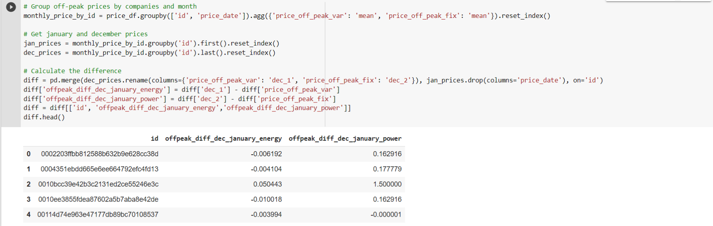
    
* **Average price changes across periods:**
     This feature is calculated as it may reveal patterns on a micro scale between months.
     
     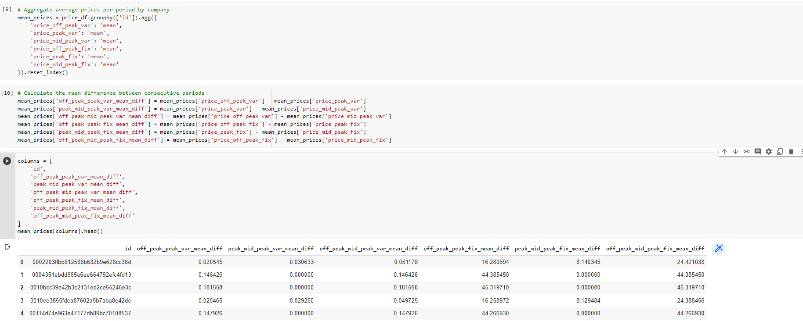

* **Max price changes across periods and months:**
    I thought that calculating the maximum price change between months and time periods would be a good feature to create because I was trying to think from the perspective of a client. As a Utilities customer, there is nothing more annoying than sudden price changes between months, and a large increase in prices within a short time span would be an influencing factor in causing me to look at other utilities providers for a better deal. Since we are trying to predict churn for this use case, I thought this would be an interesting feature to include.
    
    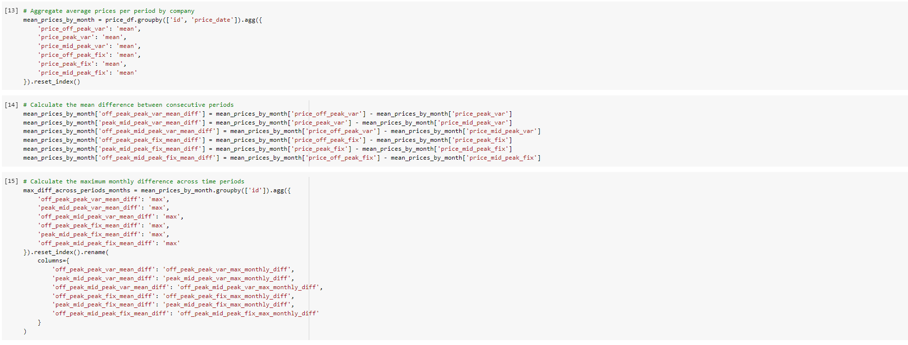
    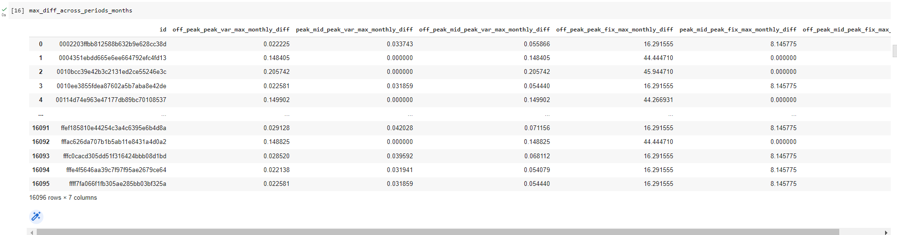
    
 * **Tenure:**
    How long a company has been a client of the Utility Company.
    
    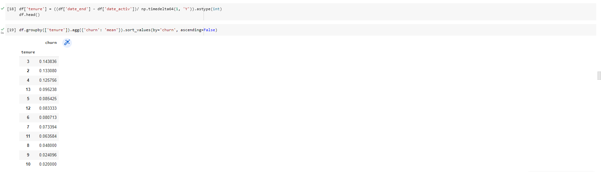
    
    We can see that companies who have only been a client for 4 or less years are much more likely to churn compared to companies that have been a client for longer. Interestingly, the difference between 4 and 5 years is about 4%, which represents a large jump in likelihood for a customer to churn compared to the other differences between ordered tenure values. Perhaps this reveals that getting a customer to over 4 years tenure is actually a large milestone with respect to keeping them as a long term customer.

    This is an interesting feature to keep for modelling because clearly how long you've been a client, has a influence on the chance of a client churning.

 * **Transforming dates into months:**
      * months_activ = Number of months active until reference date (Jan 2016)
      * months_to_end = Number of months of the contract left until reference date (Jan 2016)
      * months_modif_prod = Number of months since last modification until reference date (Jan 2016)
      * months_renewal = Number of months since last renewal until reference date (Jan 2016)

    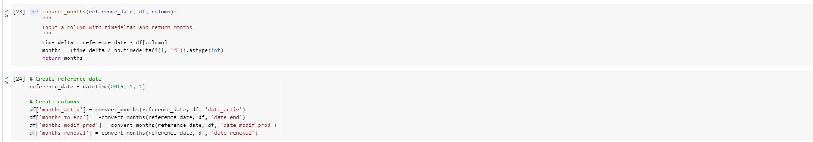
    
    Dates as a datetime object are not useful for a predictive model, so we needed to use the datetimes to create some other features that may hold some    predictive power.

    Using intuition, you could assume that a client who has been an active client of the utility company for a longer amount of time may have more loyalty to the brand and is more likely to stay. Whereas a newer client may be more volatile. Hence the addition of the months_activ feature.

    As well as this, if we think from the perspective of a client with the company, if you're coming toward the end of your contract with the company your thoughts could go a few ways. You could be looking for better deals for when your contract ends, or you might want to see out your contract and sign another one. One the other hand if you've only just joined, you may have a period where you're allowed to leave if you're not satisfied. Furthermore, if you're in the middle of your contract, their may be charges if you wanted to leave, deterring clients from churning mid-way through their agreement. So, I think months_to_end will be an interesting feature because it may reveal patterns and behaviours about timing of churn.

    My belief is that if a client has made recent updates to their contract, they are more likely to be satisfied or at least they have received a level of customer service to update or change their existing services. I believe this to be a positive sign, they are an engaged customer, and so I believe months_modif_prod will be an interesting feature to include because it shows the degree of how 'engaged' a client is with the company.

    Finally the number of months since a client last renewed a contract I believe will be an interesting feature because once again, it shows the degree to which that client is engaged. It also goes a step further than just engagement, it shows a level of commitment if a client renews their contract. For this reason, I believe months_renewal will be a good feature to include.
    
  * **Transforming Boolean data:**
      * has_gas: We simply want to transform this column from being categorical to being a binary flag. If a customer also buys gas from the company, it shows that they have multiple products and are a loyal customer to the brand. Hence, it is no surprise that customers who do not buy gas are almost 2% more likely to churn than customers who also buy gas from the company. Hence, this could be a useful feature.
      
      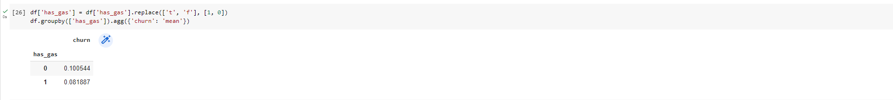

  * **Transforming categorical data:**
      * channel_sales: We have 8 categories, so we will create 8 dummy variables from this column. However, as we can see the last 3 categories in the output above, show that they only have 11, 3 and 2 occurrences respectively. Considering that our dataset has about 14000 rows, this means that these dummy variables will be almost entirely 0 and so will not add much predictive power to the model at all. For this reason, we will drop these 3 dummy variables. 
  
      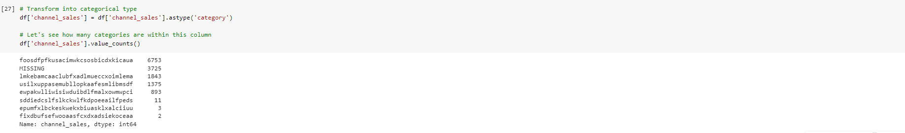
      
      * origin_up: Similar to channel_sales the last 3 categories in the output above show very low frequency, so we will remove these from the features after creating dummy variables.
      
      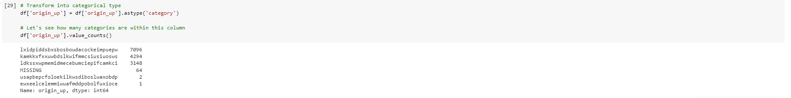

  * **Transforming numerical data:**
      In the EDA, we saw that some variables were highly skewed. We need to treat this skewness because some predictive models have inherent assumptions about the distribution of the features that are being supplied to it i.e. parametric models.

      we will use the 'Logarithm' transformation for the positively skewed features. We will add a constant of 1 to all the values as we can not apply log to values 0.

      Following are the statistics of the skewed features. We will compare them after the transformation.

      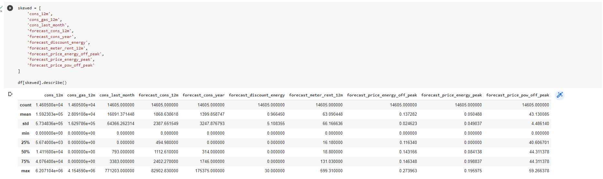
      
      We can see that the standard deviation for most of these features is quite high.
      
      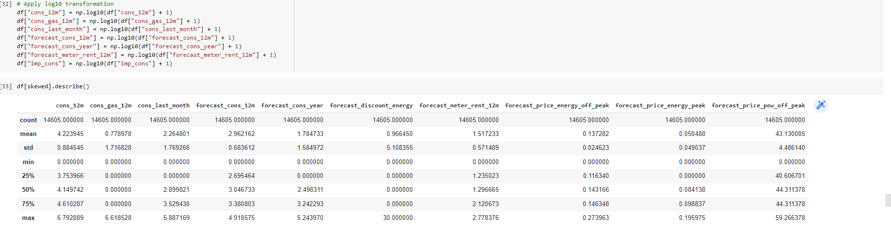
      
      Now we can see that for the majority of the features, their standard deviation is much lower after transformation.
      
      below is the the distributions of some of these features
      
      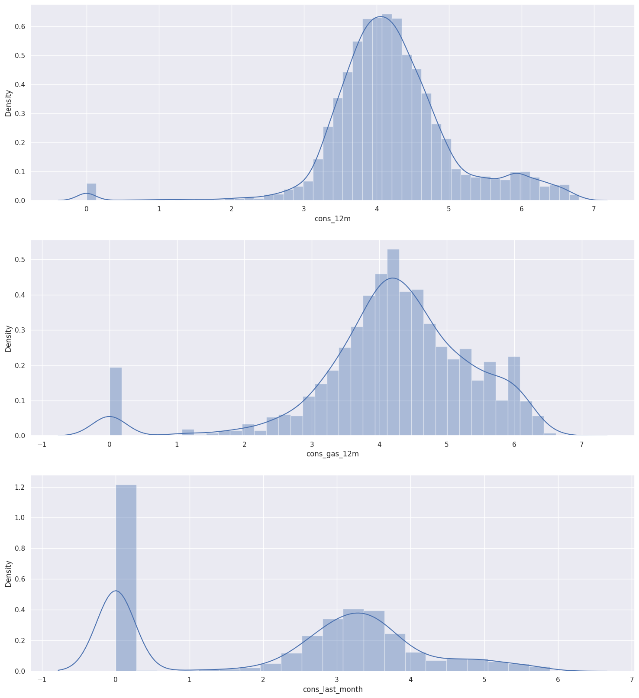
      
   * **Correlation:**
       Following correlation plot shows the correlations between all the features of our data.
       
        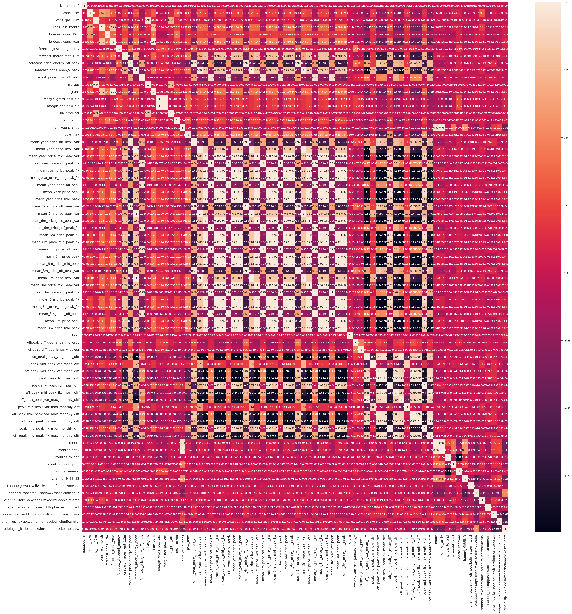

## 4. Model Development: 

We will use 'Random Forest classifier' to train our data. 

Some advantages of the random forest classifier include:

* The random forest uses a rule-based approach instead of a distance calculation and so features do not need to be scaled.
* It is able to handle non-linear parameters better than linear based models.

On the flip side, some disadvantages of the random forest classifier include:

* The computational power needed to train a random forest on a large dataset is high, since we need to build a whole ensemble of estimators.
* Training time can be longer due to the increased complexity and size of tree ensemble.

## 5. Model Evaluation:

Let's evaluate how well this trained model is able to predict the values of the test dataset.

We are going to use 3 metrics to evaluate performance:
  * Accuracy = the ratio of correctly predicted observations to the total observations
  * Precision = the ability of the classifier to not label a negative sample as positive
  * Recall = the ability of the classifier to find all the positive samples

  
  
  Following are some interpretation from the results.
  
  * Within the test set about 10% of the rows are churners (churn = 1).
  * Looking at the true negatives, we have 3277 out of 3279. This means that out of all the negative cases (churn = 0), we predicted 3277 as negative. This is great!
  * Looking at the false negatives, this is where we have predicted a client to not churn (churn = 0) when in fact they did churn (churn = 1). This number is quite high at 352, we want to get the false negatives to as close to 0 as we can, so this would need to be addressed when improving the model.
  * Looking at false positives, this is where we have predicted a client to churn when they actually didnt churn. For this value we can see there are 2 cases, which is great!
  * With the true positives, we can see that in total we have 366 clients that churned in the test dataset. However, we are only able to correctly identify 21 of those 366, which is very poor.
  * Looking at the accuracy score, this is very misleading! Hence the use of precision and recall is important. The accuracy score is high, but it does not tell us the whole story.
  * Looking at the precision score, this shows us a score of 0.91 which is not bad, but could be improved.
  * However, the recall shows us that the classifier has a very poor ability to identify positive samples. This would be the main concern for improving this model!

  So overall, we're able to very accurately identify clients that do not churn, but we are not able to predict cases where clients do churn! What we are seeing is that a high % of clients are being identified as not churning when they should be identified as churning. This in turn tells me that the current set of features are not discriminative enough to clearly distinguish between churners and non-churners.

  we need go back and investigate feature engineering to try and create more predictive features. We may also experiment with optimising the parameters within the model to improve performance. 
  
  In the Random Forest classifier, we're able to extract feature importances using the built-in method on the trained model. Let's investigate the feature importance.
  
  
  
  From this chart, we can observe the following points:

    * Net margin and consumption over 12 months is a top driver for churn in this model.
    * Margin on power subscription also is an influential driver.
    * Time seems to be an influential factor, especially the number of months they have been active, their tenure and the number of months since they updated their contract
    * Our price sensitivity features are scattered around but are not the main driver for a customer churning

  The last observation is important because this relates back to our original hypothesis:

  > Is churn driven by the customers' price sensitivity?

  Based on the output of the feature importances, it is not a main driver but it is a weak contributor. However, to arrive at a conclusive result, more experimentation is needed.

